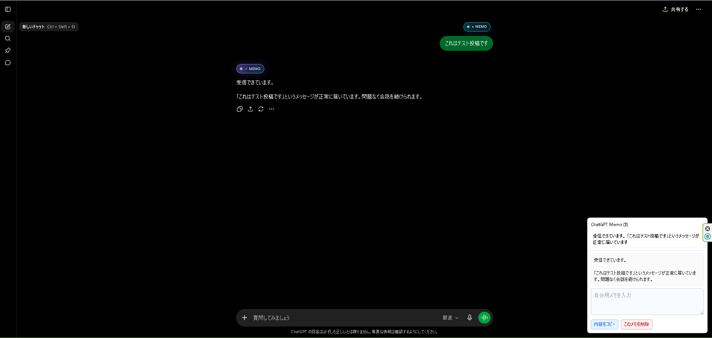

# ChatGPT Memo Marker

ChatGPTの各メッセージにメモ保存ボタンを追加できるChrome / Edge拡張です。

A browser extension for saving ChatGPT responses and personal notes.

気になった回答や後で見返したい会話を保存し、自分用のメモを付けて管理できます。

## Features

* ChatGPTの各メッセージを保存
* 自分用メモを追加
* 保存内容をクリップボードへコピー
* 不要になったメモを削除
* ChatGPTの会話ページごとにメモを管理
* データはブラウザ内にのみ保存
* 外部サーバーへの送信なし

## Supported Sites

* `https://chatgpt.com/*`
* `https://chat.openai.com/*`

## Installation

Google Chrome
* Chrome ウェブストアから ChatGPT Memo Marker をインストールします。

https://chromewebstore.google.com/detail/chatgpt-memo-marker/ebcdkmmnkphjcgiogpahiainaihllaon?hl=ja&utm_source=ext_sidebar

* ChatGPT を開きます。
* 各メッセージに表示される + MEMO ボタンからメモを保存できます。

### Chrome

1. `chrome://extensions/`
2. デベロッパーモードを有効化
3. 「パッケージ化されていない拡張機能を読み込む」
4. 本リポジトリを選択

### Edge

1. `edge://extensions/`
2. 開発者モードを有効化
3. 「展開して読み込み」
4. 本リポジトリを選択

## Usage

1. ChatGPTの会話ページを開く
2. 保存したいメッセージの `+ MEMO` ボタンをクリック
3. ヘッダーの `ChatGPT Memo` ボタンをクリックして保存済み内容を確認
4. 保存済みメモのタイトルをクリックして詳細を開く
5. 自分用メモを追加
6. 必要に応じて内容をコピー、またはメモを削除

## Data Storage

保存データはブラウザの `chrome.storage.local` に保存されます。

外部サーバーへの送信は行いません。

会話ページごとに保存キーを分けているため、別のChatGPT会話ページのメモとは分けて管理されます。

## Permissions

この拡張では以下の権限を使用します。

* `storage`: 保存したメッセージ本文と自分用メモをブラウザ内に保存するため

## Notes

この拡張はChatGPTの画面構造に依存しています。

ChatGPT側の仕様変更により一部機能が利用できなくなる場合があります。

本拡張機能のデータはブラウザのローカルストレージに保存されます。

以下の場合、保存したメモが失われる可能性があります。

* ブラウザデータを削除した場合
* 拡張機能を削除した場合
* OSやブラウザの再インストールを行った場合
* 別のPCやブラウザを使用した場合

重要なデータは別途バックアップすることを推奨します。

## License

MIT License

